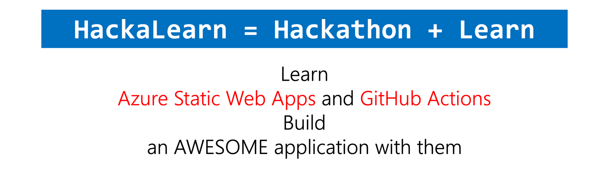
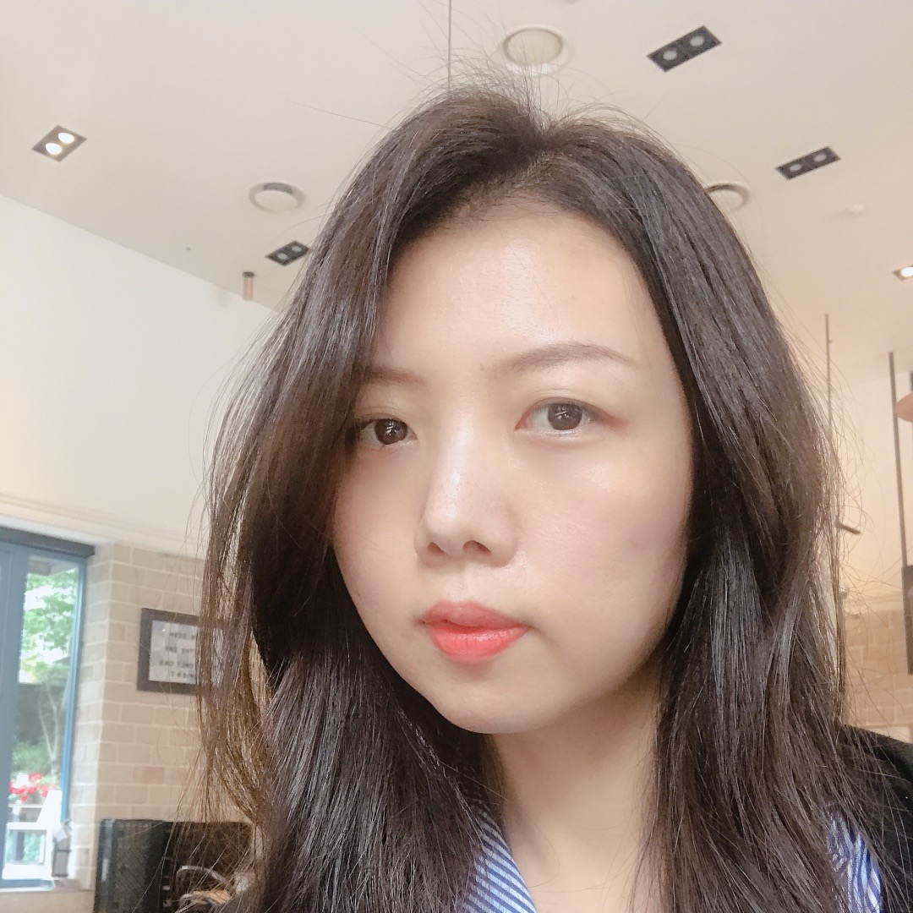
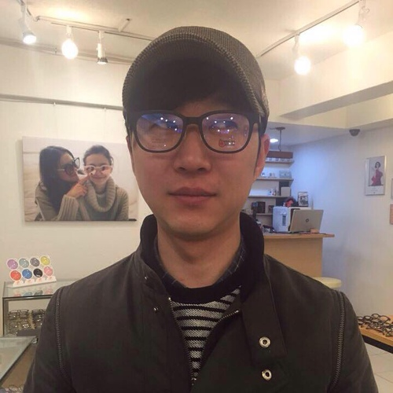
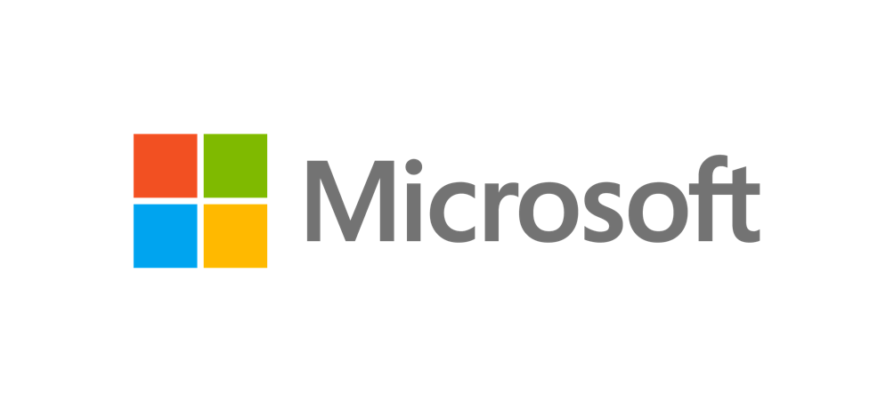

[한국어](README.md)

# HackaLearn Korea #

    

HackaLearn is the term combining both Hackathon and Learn, which is the event that you learn something and apply it during the hackathon period within the given short period of time. This HackaLearn's theme is [Azure Static Web Apps][aswa] and [GitHub Actions][gha]. For two weeks, you learn both and build a web application by yourself or with your team, through this HackaLearn event! We are looking forward to seeing the AWESOME product from you! Cool prizes are waiting for your challenge!

## ⏰ Event Timeline ##

* Registration: August 2, 2021, 00.00am (KST) - August 16, 2021, 00.00am (KST)
* Submission Due: August 16, 2021, 00.00am (KST)
* Judgement: August 16 - 19, 2021 (KST)
* Announcement: August 20, 2021 (KST)

## 🙆🏻‍♀️ Eligibility ##

* Anyone who wants to participate! However...
  * During the event period, participants MUST reside in Korea and prove their address details on request.

## 🏃🏻‍♂️ How to Participate? ##

1. Register yourself or your team to the HackaLearn event 👉 Registration link will be open on August 2, 2021, 00.00am (KST)
2. Complete all the challenge missions below.
3. On completion of each challenge, create a PR to this repository to [submit your challenge][submit].
4. Ask anything during the challenge at the [Q&A][qna] board.

## ✅ Challenge Missions ##

You MUST complete **all the SIX challenge missions** below. For more details will be disclosed on the day of the registration.

1. **Cloud Skills Challenge #1**: TBA
1. **Cloud Skills Challenge #2**: TBA
1. **Social Media Selfie Challenge**: TBA
1. **Web Application Challenge**: TBA
1. **GitHub Repository Challenge**: TBA
1. **Blog Retrospective Challenge**: TBA

## 👑 Hall of Fame ##

Teams who complete **all the FIVE challenge missions** are in the Hall of Fame. 👉 [Visit Hall of Fame][hof]

## 💻 Hands-on-Lab Workshops ##

During the event, we are running a few hands-on-lab workshops for you. After these sessions, you will be able to build your own web applications!

* Hands-on-Lab with [Microsoft Learn Student Ambassadors (MLSA)][mlsa]
* Hands-on-Lab with [GitHub Campus Experts (GCE)][gce]
* Hands-on-Lab with [Microsoft Cloud Advocate (CA)][ca]

## 🛠 Developer Tools Before You Go ##

All participants are required to utilise many development tools and free accounts during this HackaLearn event. Visit the following page to get all the tools you need.
👉 [Developer Tools and Free Accounts][tools]

## 🧑🏻‍🏫 Technical Mentors ##

During the challenge, participants may have technical questions to figure out. Here are MLSA, GCE, CA and many technical mentors from various industry helping you solve your technical challenges.
 

|  |  |  |  |  |
| :---: | :---: | :---: | :---: | :---: |
| General [Chulhyun Cho](./mentors#chulhyuncho) Innovation Academy &nbsp; &nbsp; &nbsp; &nbsp; &nbsp; &nbsp; &nbsp; &nbsp; &nbsp; &nbsp; &nbsp; | Product Management / Planning [Sue Kim](./mentors#suekim) Angelhack &nbsp; &nbsp; &nbsp; &nbsp; &nbsp; &nbsp; &nbsp; &nbsp; &nbsp; &nbsp; &nbsp; | UX [Aimee Park](./mentors#aimeepark) IBM &nbsp; &nbsp; &nbsp; &nbsp; &nbsp; &nbsp; &nbsp; &nbsp; &nbsp; &nbsp; &nbsp; | Front-end Development [Jay Lim](./mentors#jaylim) Market Kurly &nbsp; &nbsp; &nbsp; &nbsp; &nbsp; &nbsp; &nbsp; &nbsp; &nbsp; &nbsp; &nbsp; | Back-end Development [Minho Yang](./mentors#minhoyang) Common Computer &nbsp; &nbsp; &nbsp; &nbsp; &nbsp; &nbsp; &nbsp; &nbsp; &nbsp; &nbsp; &nbsp; |

## 🏅 Awards ##

* All participants who complete 6 challenges
* 1 Team for Best Creativity &ndash; 1 Team
* 1 Team for Best UX &ndash; 1 Team
* 1 Team for Best Social Good &ndash; 1 Team

## 🏆 Prizes ##

* 1 Team for Best Creativity &ndash; JBL Charge 4
* 1 Team for Best UX &ndash; Microsoft Surface Headphones 2
* 1 Team for Best Social Good &ndash; Microsoft Surface Laptop 4

![Prizes][prizes]

> * Prize details may change without prior notice.

## 🎭 Privacy Policy ##

HackaLearn Korea handles your personal data seriously during this event. For more details, please visit the [Privacy Policy][privacy] page.

## 👨‍👩‍👧‍👦 Code of Conduct ##

HackaLearn Korea endeavours that every single participant in this event feels safe and inclusive during this event period. Everyone MuST be open and show respect to each other. For more details, please visit the [Code of Conduct][coc] page.

## 🥑 Sponsorship ##

Thanks Microsoft for sponsoring this event to run smoothly.

    

[aswa]: https://aka.ms/hackalearn/aswa/intro
[gha]: https://aka.ms/hackalearn/gha/intro
[prizes]: assets/prizes-768x432@2.png
[submit]: https://aka.ms/hacklearn/submit
[qna]: https://aka.ms/hackalearn/qna
[hof]: HALL_OF_FAME.md
[privacy]: https://aka.ms/hackalearn/privacy
[coc]: https:/aka.ms/hackalearn/coc
[microsoft]: assets/logo-microsoft.png
[mlsa]: https://aka.ms/hackalearn/mlsa
[gce]: https://aka.ms/hackalearn/gce
[ca]: https://aka.ms/hackalearn/ca
[tools]: ./tools
