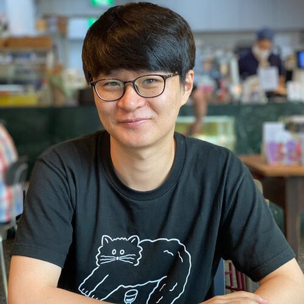

[한국어](README.md)

# HackaLearn Korea #

    

***HackaLearn 2021 IS OVER.***

HackaLearn is the term combining both Hackathon and Learn, which is the event that you learn something and apply it during the hackathon period within the given short period of time. This HackaLearn's theme is [Azure Static Web Apps][aswa] and [GitHub Actions][gha]. For two weeks, you learn both and build a web application by yourself or with your team, through this HackaLearn event! We are looking forward to seeing the AWESOME product from you! Cool prizes are waiting for your challenge!

   
  <!--  -->
  
   

## 🏅 HackaLearn Winners ##

Here are winners for HackaLearn. Congratulations to all winners!

* Completion of Cloud Skills Challenge 👉 [View Winners](./CLOUD_SKILL_CHALLENGES.md)
* Social Media Challenge &ndash; 2 Winners 👉 [김시연](https://www.instagram.com/p/CSlyUPzpfWr/?utm_medium=copy_link), [박주은](https://www.instagram.com/p/CSlGgG8Ag0a/?utm_medium=copy_link)
* Blog Post Challenge &ndash; 3 Winners 👉 [김호정](https://velog.io/@hokim/HackaLearn-%EC%B0%B8%EC%97%AC-%ED%9B%84%EA%B8%B0-%ED%8C%80%EC%98%A4%EB%AF%80-%EB%9D%BC%EC%9D%B4%EC%8A%A4), [김예림](https://blog.naver.com/sedagrq821/222470813632), [박수빈](https://subeen.io/blog/devs/2021-08-15-HackaLearn/)
* Best for Creativity &ndash; 1 Winner 👉 [KING](./teams/KING.md)
* Best for UX &ndash; 1 Winner 👉 [생생한국통](./teams/생생한국통.md)
* Best for Social Good &ndash; 1 Winner 👉 [월급두배받는법](./teams/월급두배받는법.md)

## ⏰ Event Timeline ##

* Registration: August 2, 2021, 00.00am (KST) - August 16, 2021, 00.00am (KST)
* Submission Due: August 16, 2021, 00.00am (KST)
* Judgement: August 16 - 19, 2021 (KST)
* Announcement: August 20, 2021 (KST)

## 🙆🏻‍♀️ Eligibility ##

* Anyone who wants to participate! However...
  * During the event period, participants MUST reside in Korea and prove their address details on request.

## 🏃🏻‍♂️ How to Participate? ##

1. Register yourself or your team to the HackaLearn event 👉 [Registration][rego]
2. Complete all the challenge missions below.
3. On completion of each challenge, create a PR to this repository to [submit your challenge][submit].
4. Ask anything during the challenge at the [Q&A][qna] board.

## ✅ Challenge Missions ##

You MUST complete **all the SIX challenge missions** below. For more details will be disclosed on the day of the registration.

1. **Cloud Skills Challenge #1** 👉 [Azure Static Web Apps Learn Challenge](./challenges/ASWA.md)
1. **Cloud Skills Challenge #2** 👉 [GitHub Actions Learn Challenge](./challenges/GHA.md)
1. **Social Media Selfie Challenge** 👉 [Social Media Selfie Challenge](./challenges/SOCIAL.md)
1. **Web Application Challenge** 👉 [Web Application Challenge](./challenges/APP.md)
1. **GitHub Repository Challenge** 👉 [GitHub Repository Challenge](./challenges/REPO.md)
1. **Blog Retrospective Challenge** 👉 [Blog Retrospective Challenge](./challenges/RETRO.md)

## 👑 Hall of Fame ##

Teams who complete **all the SIX challenge missions** are in the Hall of Fame. 👉 [Visit Hall of Fame][hof]

## 🏆 Individual Challenges Completion ##

Although not all SIX challenge missions have completed, teams and members who completed each challenge are also listed on the page.

* **Completion of Cloud Skills Challenge &ndash; Azure Static Web Apps & GitHub Actions** 👉 [View](./CLOUD_SKILL_CHALLENGE.md)
* **Completion of Social Media Challenge** 👉 [View](./SNS_POSTS.md)
* **Completion of Azure Static Web Apps URL Challenge** 👉 [View](./ASWA_APPS.md)
* **Completion of GitHub Repository Challenge** 👉 [View](./ASWA_REPOS.md)
* **Completion of Blog Post Challenge** 👉 [View](./BLOG_POSTS.md)

## 💻 Hands-on-Lab Workshops ##

During the event, we are running a few hands-on-lab workshops for you. After these sessions, you will be able to build your own web applications!

| Topic | Date/Time | Streaming | Slides | Codes |
| :--: | :--: | :--: | :--: | :--: |
| Code with [GCE][gce]: GitHub Actions | 8pm, August 3 (Tue), 2021 | [Live Streaming][live gce] | [Download][slide gce] | [Link][code gce] |
| Code with [MLSA][mlsa]: Azure Static Web Apps | 8pm, August 5 (Thu), 2021 | [Live Streaming][live mlsa] | [Download][slide mlsa] | [Link][code mlsa] |
| Code with [Cloud Advocate][ca]: Building Gatsby Blog | 8pm, August 10 (Tue), 2021 | [Live Streaming][live ca] | [Download][slide ca] | [Link][code ca] |

## 🛠 Developer Tools Before You Go ##

* All participants are required to utilise many development tools and free accounts during this HackaLearn event. Visit the following page to get all the tools you need. 👉 [Developer Tools and Free Accounts][tools]
* Git & GitHub 101 👉 Watch [YouTube video][git yt]

## 🧑🏻‍🏫 Technical Mentors ##

During the challenge, participants may have technical questions to figure out. Here are MLSA, GCE, CA and many technical mentors from various industry helping you solve your technical challenges.
 

|  |  |  |  |  |
| :---: | :---: | :---: | :---: | :---: |
| General [Chulhyun Cho](./mentors#chulhyuncho) Innovation Academy &nbsp; &nbsp; &nbsp; &nbsp; &nbsp; &nbsp; &nbsp; &nbsp; &nbsp; &nbsp; &nbsp; | Product Management / Planning [Sue Kim](./mentors#suekim) Angelhack &nbsp; &nbsp; &nbsp; &nbsp; &nbsp; &nbsp; &nbsp; &nbsp; &nbsp; &nbsp; &nbsp; | UX [Aimee Park](./mentors#aimeepark) IBM &nbsp; &nbsp; &nbsp; &nbsp; &nbsp; &nbsp; &nbsp; &nbsp; &nbsp; &nbsp; &nbsp; | Front-end Development [Jay Lim](./mentors#jaylim) Market Kurly &nbsp; &nbsp; &nbsp; &nbsp; &nbsp; &nbsp; &nbsp; &nbsp; &nbsp; &nbsp; &nbsp; | Back-end Development [Minho Ryang](./mentors#minhoryang) Common Computer &nbsp; &nbsp; &nbsp; &nbsp; &nbsp; &nbsp; &nbsp; &nbsp; &nbsp; &nbsp; &nbsp; |

## 🏅 Awards ##

* All participants who complete 6 challenges 👉 [View Winners](./CLOUD_SKILL_CHALLENGES.md)
* Social Media Challenge &ndash; 2 Winners 👉 [김시연](https://www.instagram.com/p/CSlyUPzpfWr/?utm_medium=copy_link), [박주은](https://www.instagram.com/p/CSlGgG8Ag0a/?utm_medium=copy_link)
* Blog Post Challenge &ndash; 3 Winners 👉 [김호정](https://velog.io/@hokim/HackaLearn-%EC%B0%B8%EC%97%AC-%ED%9B%84%EA%B8%B0-%ED%8C%80%EC%98%A4%EB%AF%80-%EB%9D%BC%EC%9D%B4%EC%8A%A4), [김예림](https://blog.naver.com/sedagrq821/222470813632), [박수빈](https://subeen.io/blog/devs/2021-08-15-HackaLearn/)
* Best Creativity &ndash; 1 Winner 👉 [KING](./teams/KING.md)
* Best UX &ndash; 1 Winner 👉 [생생한국통](./teams/생생한국통.md)
* Best Social Good &ndash; 1 Winner 👉 [월급두배받는법](./teams/월급두배받는법.md)

## 🏆 Prizes ##

* 1 Team for Best Creativity &ndash; JBL Charge 4
* 1 Team for Best UX &ndash; Microsoft Surface Headphones 2
* 1 Team for Best Social Good &ndash; Microsoft Surface Laptop 4

![Prizes][prizes]

> * Prize details may change without prior notice.

## 🎭 Privacy Policy ##

HackaLearn Korea handles your personal data seriously during this event. For more details, please visit the [Privacy Policy][privacy] page.

## 👨‍👩‍👧‍👦 Code of Conduct ##

HackaLearn Korea endeavours that every single participant in this event feels safe and inclusive during this event period. Everyone MuST be open and show respect to each other. For more details, please visit the [Code of Conduct][coc] page.

## 🥑 Sponsorship ##

Thanks Microsoft for sponsoring this event to run smoothly.

    

[aswa]: https://aka.ms/hackalearn/aswa/intro
[gha]: https://aka.ms/hackalearn/gha/intro
[prizes]: assets/prizes-768x432@2.png
[rego]: http://aka.ms/hackalearn/register
[submit]: https://aka.ms/hacklearn/submit
[qna]: https://aka.ms/hackalearn/qna
[hof]: HALL_OF_FAME.md
[privacy]: https://aka.ms/hackalearn/privacy
[coc]: https:/aka.ms/hackalearn/coc
[microsoft]: assets/logo-microsoft.png
[mlsa]: https://aka.ms/hackalearn/mlsa
[gce]: https://aka.ms/hackalearn/gce
[ca]: https://aka.ms/hackalearn/ca
[tools]: ./tools
[git yt]: https://www.youtube.com/playlist?list=PLDZRZwFT9WktMraaU2KPeU8nPx5O1CXv_
[live mlsa]: https://youtu.be/Hxkv6AjAisY
[live gce]: https://youtu.be/e_elLW6uNSc
[live ca]: https://youtu.be/x3j3mDblqMY
[slide mlsa]: https://aka.ms/hackalearn/aswa/hol
[slide gce]: https://aka.ms/hackalearn/gha/hol
[slide ca]: https://aka.ms/hackalearn/hol/slides
[code mlsa]: https://aka.ms/hackalearn/aswa/code
[code gce]: https://aka.ms/hackalearn/gha/code
[code ca]: https://aka.ms/hackalearn/hol/code
