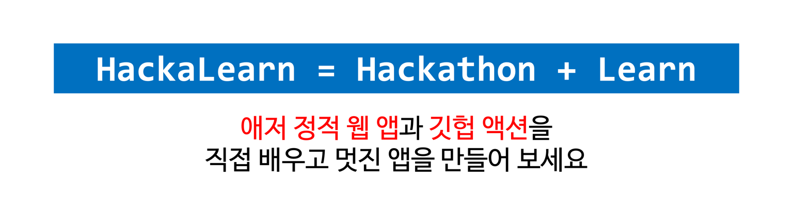

[English](README.en.md)

# HackaLearn Korea #

    

HackaLearn은 Hackathon + Learn의 합성어로 주어진 기간 안에 관련 지식을 직접 배워서 해커톤에 적용하는 이벤트입니다. 이번 HackaLearn 이벤트의 주제는 바로 [애저 정적 웹 앱(Azure Static Web Apps)][aswa]과 [깃헙 액션(GitHub Actions)][gha]입니다. 2주간 공부하고 직접 웹 애플리케이션을 만들어 보는 HackaLearn 이벤트! 멋진 애플리케이션을 만들어 보세요! 푸짐한 상품이 기다립니다.

## ⏰ 일정 ##

* 참가 신청기간: 2021년 8월 2일 0시 - 2021년 8월 16일 0시
* 결과제출 마감기한: 2021년 8월 16일 0시
* 심사 기간: 2021년 8월 16일 - 19일
* 수상자 발표: 2021년 8월 20일

## 🙆🏻‍♀️ 참여 자격 ##

* 참여하고 싶은 누구나 가능합니다! 단...
  * 행사 기간 중 한국내 거주자로서 요청시 자신의 거주지를 증명할 수 있어야 합니다.

## 🏃🏻‍♂️ 참여 방법 ##

1. HackaLearn 이벤트에 참가 신청합니다. 👉 참가 신청 링크 추후 공개
2. 아래 챌린지 미션을 모두 완료합니다.
3. 챌린지 미션을 완료할 때 마다 PR을 생성하여 운영진에게 [제출][submit]합니다.
4. 챌린지 도중 궁금한 사항이 있을 땐 언제든 [질문/답변][qna] 방을 이용해 주세요.

## ✅ 챌린지 미션 ##

총 **여섯 가지 챌린지 미션**을 완료해야 합니다. 자세한 사항은 등록 시점에 알려드립니다.

1. **클라우드 스킬 챌린지 #1**: 링크 추후 공개
1. **클라우드 스킬 챌린지 #2**: 링크 추후 공개
1. **SNS 인증 챌린지**: 방법 추후 공개
1. **웹 애플리케이션 챌린지**: 방법 추후 공개
1. **GitHub 저장소 챌린지**: 방법 추후 공개
1. **블로그 후기 챌린지**: 방법 추후 공개

## 👑 명예의 전당 Hall of Fame ##

**여섯 가지 챌린지 미션**을 모두 완료한 팀은 명예의 전당에 기록이 됩니다. 👉 [명예의 전당 바로가기][hof]

## 💻 핸즈온 랩 세션 ##

HackaLearn 기간 중 다양한 핸즈온 랩 세션을 준비했습니다. 함께 애저 정적 웹 앱, 깃헙 액션을 만들어 보고 여러분의 애플리케이션 개발에 적용시켜 보세요!

* [Microsoft Learn Student Ambassadors][mlsa]와 함께 하는 핸즈온 랩 세션
* [GitHub Campus Experts][gce]와 함께 하는 핸즈온 랩 세션
* [Microsoft Cloud Advocate][ca]와 함께 하는 핸즈온 랩 세션

## 🏅 시상 부문 ##

* 여섯 가지 모든 챌린지를 완료한 참가자 전부
* 가장 창의적인 애플리케이션 &ndash; 한 팀
* 가장 UX가 뛰어난 애플리케이션 &ndash; 한 팀
* 가장 사회 공헌적인 애플리케이션 &ndash; 한 팀

## 🏆 시상품 ##

* 가장 창의적인 애플리케이션 &ndash; 한 팀 &ndash; JBL Charge 4
* 가장 UX가 뛰어난 애플리케이션 &ndash; 한 팀 &ndash; 마이크로소프트 서피스 헤드폰 2
* 가장 사회 공헌적인 애플리케이션 &ndash; 한 팀 &ndash; 마이크로소프트 서피스 랩탑 4

![상품 목록][prizes]

> * 상품 관련 세부 사항은 예고 없이 달라질 수 있습니다.

## 🎭 개인정보 보호정책 ##

HackaLearn Korea는 여러분의 개인 정보를 소중히 여깁니다. 개인 정보 보호와 관련한 자세한 내용은 [개인정보 보호정책][privacy] 페이지를 참고해 주세요.

## 👨‍👩‍👧‍👦 행동 강령 Code of Conduct ##

HackaLearn Korea는 참가자 여러분들 모두가 행사 기간 중 마음 편안하게 참여하실 수 있게끔 모두에게 공정하고 상호 존중하도록 행동 강령을 정하고 있습니다. 좀 더 자세한 내용은 [행동 강령][coc] 페이지를 참고해 주세요.

## 🥑 후원 ##

이 행사는 마이크로소프트에서 후원합니다.

    

[aswa]: https://aka.ms/hackalearn/aswa/intro
[gha]: https://aka.ms/hackalearn/gha/intro
[prizes]: assets/prizes-768x432@2.png
[submit]: https://aka.ms/hacklearn/submit
[qna]: https://aka.ms/hackalearn/qna
[hof]: HALL_OF_FAME.md
[privacy]: https://aka.ms/hackalearn/privacy
[coc]: https:/aka.ms/hackalearn/coc
[microsoft]: assets/logo-microsoft.png
[mlsa]: https://aka.ms/hackalearn/mlsa
[gce]: https://aka.ms/hackalearn/gce
[ca]: https://aka.ms/hackalearn/ca