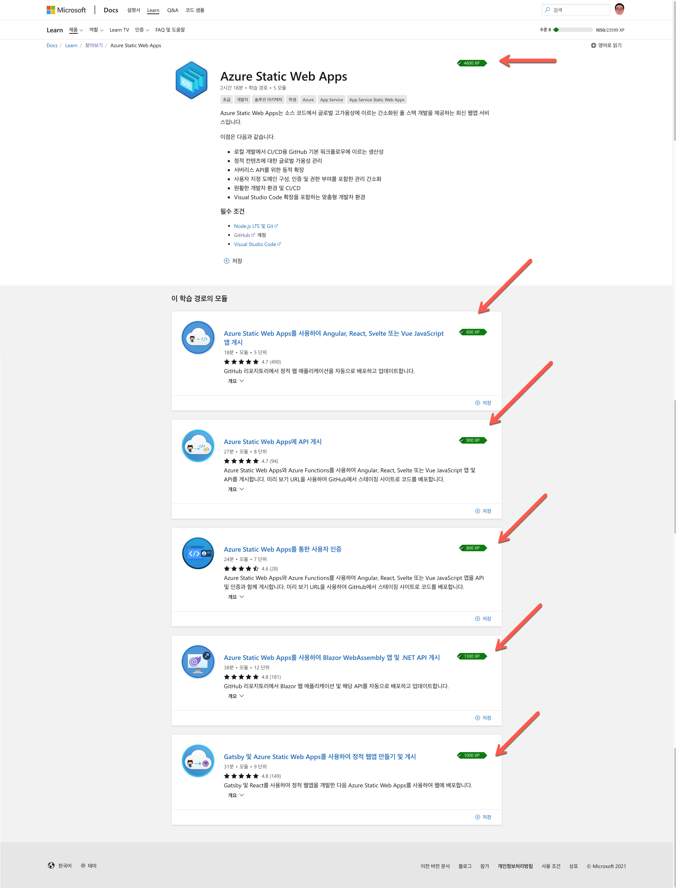

# 챌린지 #1: 애저 정적 웹 앱 Learn 챌린지 #

[클라우드 스킬 챌린지][csc]를 통해 [애저 정적 웹 앱][aswa]을 배워 보세요! 클라우드 스킬 챌린지를 통해 애저 정적 웹 앱을 다 배우고 나면 아래 그림과 같이 각 모듈마다 녹색 뱃지가 나타납니다.

모든 모듈에 녹색 뱃지가 나타나면 여러분은 이 애저 정적 웹 앱 Learn 챌린지를 완수하신 겁니다. 스크린샷을 저장한 후 해당 링크를 여러분의 팀 페이지에 저장한 후 PR을 생성해 주세요.

> ***NOTE:*** 명심하세요! PR 생성시 여러분의 Microsoft Learn 프로필 URL을 반드시 포함시켜야 합니다. 예) `https://docs.microsoft.com/ko-kr/users/xxxxx`
> 
> ***NOTE:*** 명심하세요! 여러분의 팀원 모두가 각자 챌린지를 완수해야 합니다.

[aswa]: https://aka.ms/hackalearn/aswa/intro
[csc]: https://aka.ms/hackalearn/csc
