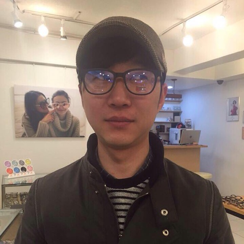

# HackaLearn Korea 멘토 ##

## 조철현 멘토 &ndash; 일반 ##

  

> CJENM에서 CJmall.com을 만들고, 해외사업에서 해외 플랫폼을 구축하는 일을 수행하였으며, 이커머스개발팀장을 지내고, SK플래닛에서 말레이시아 오픈마켓 플랫폼을 구축하는 프로젝트를 수행하였습니다. 사회적협동조합 데브옵스 코리아 이사장을 역임하고 있으며, 데브옵스 문화와 기술 확산을 위한 활동을 하고 있습니다. Splunk로 데이터/로그 분석 및 시각화를 위한 엔지니어로 활동하고, 커머스 분야 전반적인 컨설팅을 수행해왔습니다. 현재는 (재)이노베이션 아카데미에서 멘토로 재직중에 있습니다.

## 김수정 멘토 &ndash; 기획 ##

  

> 안녕하세요. 김수정입니다. 글로벌 해커톤 Angelhack Seoul을 운영하면서 해커톤 운영 및 멘토 경험을 쌓았습니다. 현재 영어 교육 앱 회사인 퀄슨에서 Product owner 로 재직 중입니다. 기획 분야와 관련해 많은 질문 부탁드려요! :D

## 박정은 멘토 &ndash; UX ##

  

> 사람과 사람, 사람과 기술을 연결하는 일을 하고있는 박정은 입니다. Service design, UX를 공부했고 지금은 IBM Garage designer로 즐겁고 바쁜 시간을 보내고 있습니다. 사람을 위한 IT 서비스를 잘 하고싶고 저와 같은 고민을 하는 분들과 경험을 공유하고 싶습니다.

## 임진호 멘토 &ndash; 프론트엔드 ##

  

> 마켓컬리 물류 조직에서 프론트엔드 개발을 하고 있습니다. 비전공자로 남들 보다 늦은 나이에 개발을 시작했지만 LESS(Learn, Enjoy, Solve, Share)한 삶을 살아가고 있습니다.

## 양민호 멘토 &ndash; 백엔드 ##

  

> 안녕하세요 양민호 개발자입니다.
>
> 백엔드 개발을 좋아합니다. 보이지 않는 부분에서 마법과 같은 경험을 설계하는 것을 좋아합니다. 취미로 오픈소스활동을 하고 있습니다. AI + Blockchain 스타트업 커먼컴퓨터에서 가치의 인터넷이라는 미래를 설계하고 있습니다.

